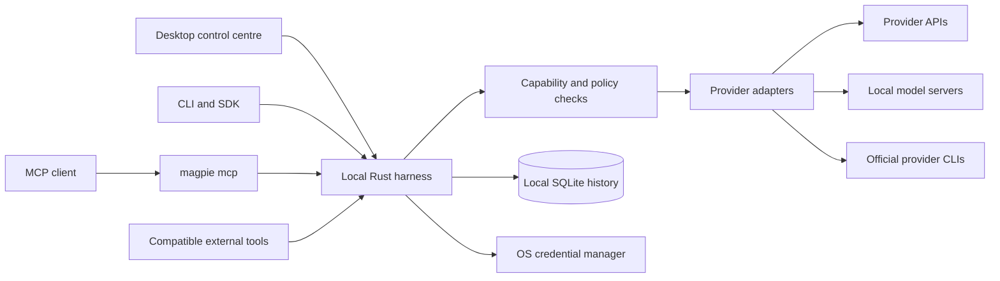

# Magpie

**One local control centre for your AI providers, models, routing, and usage.**

Magpie connects API accounts, local model servers, and supported official provider CLIs to a Rust service on your computer. Manage those connections in the desktop app, then send work from your own scripts, compatible tools, the Magpie CLI, or the TypeScript SDK.

The desktop is a control centre with no chat interface. You do not need a hosted Magpie account. The service, called the **harness**, runs independently of the window and exposes an authenticated local API.

[Download installers](https://github.com/ChristianRelf/Magpie/releases/latest) · [GitHub wiki](https://github.com/ChristianRelf/Magpie/wiki) · [Repository handbook](docs/wiki/Home.md) · [Report an issue](https://github.com/ChristianRelf/Magpie/issues)

## Contents

- [What you can do](#what-you-can-do)
- [Install and make your first request](#install-and-make-your-first-request)
- [How Magpie works](#how-magpie-works)
- [Connect providers](#connect-providers)
- [Use the desktop](#use-the-desktop)
- [Choose models and routing](#choose-models-and-routing)
- [Use the API, CLI, SDK, and MCP](#use-the-api-cli-sdk-and-mcp)
- [Understand usage, limits, and costs](#understand-usage-limits-and-costs)
- [Background operation and local data](#background-operation-and-local-data)
- [Fix problems](#fix-problems)
- [Build, test, and contribute](#build-test-and-contribute)
- [Documentation map](#documentation-map)
- [Project status and limits](#project-status-and-limits)

## What you can do

| Need                        | Magpie provides                                                                                                 |
| --------------------------- | --------------------------------------------------------------------------------------------------------------- |
| Manage several providers    | Connection verification, model discovery, labels, enable/disable controls, and separate API credentials         |
| Choose a suitable model     | Automatic routing, quality/speed/cost presets, task rules, model preferences, and inspectable selection reasons |
| Keep existing tools         | Chat Completions compatibility, a native response API, CLI, SDK, and stdio MCP bridge                           |
| Understand a failed request | Execution history, attempt details, structured errors, routing exclusions, and known limit windows              |
| Track activity              | Request counts, reported tokens, measured latency, cost provenance, and calendar/time-series views              |
| Monitor subscriptions       | Supported official CLI account reports and an opt-in Claude Code status-line allowance bridge                   |
| Control access              | Revocable integration keys with `read`, `execute`, `agent`, and `admin` permissions                             |
| Keep work running           | An independent service, optional tray behaviour, and opt-in launch at login                                     |

**Version guide:** this documentation follows **v0.1.3**, published on **2026-10-08**, including separate Codex browser sign-ins and saved Claude Code tokens. The [saved sign-ins guide](docs/wiki/Saved-sign-ins.md) explains those workflows and their limits. Older 0.1.2 installers do not include saved profiles; keep the desktop, CLI, SDK, and harness versions compatible. Consult [releases](https://github.com/ChristianRelf/Magpie/releases) and the [implementation record](docs/STATUS.md) for verification evidence.

## Install and make your first request

### 1. Choose an installer

Download the package for your computer from [GitHub Releases](https://github.com/ChristianRelf/Magpie/releases/latest).

| System                          | Package                          |
| ------------------------------- | -------------------------------- |
| Linux x64, Debian/Ubuntu family | `.deb`                           |
| Linux x64, portable app         | `.AppImage`                      |
| Windows x64                     | `x64-setup.exe` / NSIS installer |
| macOS Apple Silicon             | `aarch64.dmg`                    |
| macOS Intel                     | `x64.dmg`                        |

Release assets include `SHA256SUMS` and `release-manifest.json`. The documented 0.1.3 builds are unsigned/unnotarised and use manual updates; a checksum verifies the downloaded bytes, not a platform signing identity. See [installation and updates](docs/wiki/Installation-and-updates.md) for verification commands and platform troubleshooting.

Ordinary installation does not require Rust, Node, or pnpm. Install an official provider CLI separately only if you plan to use its CLI connection. The desktop installer should not be assumed to put the separate `magpie` command on your shell's `PATH`; [CLI setup](docs/wiki/CLI-reference.md#install-the-cli) explains how to build it.

### 2. Connect a provider

Open Magpie and complete onboarding, or use **Providers → Connect provider**.

- **API account:** select the provider, supply its API key, and verify the connection. Magpie stores the key in your OS credential manager.
- **Local server:** start Ollama, LM Studio, or another compatible server first. Load or install a model there, then connect its endpoint in Magpie.
- **Official CLI:** install the CLI, then connect an existing shared login or use the supported separate Codex sign-in/saved Claude token flow. [Saved sign-ins](docs/wiki/Saved-sign-ins.md) explains account isolation and renewal.

Open **Models** and confirm there is an available model suitable for your request. A connected account can still have unavailable models or lack a required capability. [Provider setup](docs/wiki/Provider-setup.md) gives individual connection recipes.

### 3. Create an integration key

Open **Integrations**, create a named key, and grant `read` and `execute` for this walkthrough. Copy the token when displayed; Magpie stores its hash, so the full token cannot be recovered later. Use a separate key for each tool.

For Bash examples, set the token without placing it in your command history:

```bash
read -rsp 'Magpie integration key: ' MAGPIE_API_KEY
printf '\n'
export MAGPIE_API_KEY
export MAGPIE_URL='http://127.0.0.1:7878'
```

This is a **Magpie integration key**, not an upstream provider key. The upstream credential remains with Magpie or the official CLI.

### 4. Check the service and preview a route

These checks do not run a model:

```bash
curl --fail-with-body "$MAGPIE_URL/health"

curl --fail-with-body "$MAGPIE_URL/v1/models" \
  -H "Authorization: Bearer $MAGPIE_API_KEY"

curl --fail-with-body "$MAGPIE_URL/v1/route" \
  -H "Authorization: Bearer $MAGPIE_API_KEY" \
  -H 'Content-Type: application/json' \
  -d '{"model":"auto","input":"Explain what a local API is in one sentence."}'
```

`/health` should identify `Magpie`, report `status: "ok"`, and include version information. The models response includes an `auto` entry plus discovered models. A successful route preview explains the selected candidate and alternatives. For `no_eligible_model`, follow [routing troubleshooting](docs/wiki/Troubleshooting.md#no-eligible-model).

### 5. Execute a request

This step runs a model and can use provider allowance or incur API charges:

```bash
curl --fail-with-body --no-buffer "$MAGPIE_URL/v1/responses" \
  -H "Authorization: Bearer $MAGPIE_API_KEY" \
  -H 'Content-Type: application/json' \
  -d '{
    "model":"auto",
    "input":"Explain what a local API is in one sentence.",
    "max_output_tokens":128,
    "stream":true
  }'
```

Expect named SSE events such as `started`, `text_delta`, and `completed`. A failure after streaming starts is a `failed` event; HTTP 200 alone does not prove success. Set `stream` to `false` for a single JSON result and read `output_text`.

Open **Activity** to inspect the request, selected connection, tokens, duration, and fallback attempts. If only Codex CLI or Gemini CLI is connected, use the explicit [agent workflow](#official-cli-agent-workflows) instead of this plain text example.

## How Magpie works



The desktop starts or discovers a compatible harness. The standalone CLI can start the same runtime without a window. A private runtime record lets owner clients find the service; a filesystem lock prevents two harnesses from sharing one database.

For each execution:

1. The API validates the request host, authenticates the key, and checks permissions.
2. The router classifies the task using request hints and local heuristics. Classification does not call a model.
3. It filters models by connection state, capabilities, estimated context requirements, reported limits, and billing preferences.
4. It ranks eligible models using the preset, task rules, priorities, and available execution history.
5. An adapter translates the request and streams events back. Client-defined function calls go back to the client to execute; CLI agents manage their own tool loop.
6. The engine records timing, reported usage, errors, and attempts. Fallback follows policy and stops being safe once meaningful output or side effects have occurred.

SQLite contains settings, account/model metadata, hashed integration keys, and retained execution history. Provider API secrets use the OS credential manager. Prompt and response retention is off by default. Requests to a cloud provider still send their contents to that provider.

See [how it works](docs/wiki/How-it-works.md) for process lifecycle, storage, routing, cancellation, and the crate map.

## Connect providers

| Connection                 | CLI kind / identifier | Setup and behaviour                                                               |
| -------------------------- | --------------------- | --------------------------------------------------------------------------------- |
| OpenAI API                 | `openai`              | API key; Chat Completions; Responses-only Codex models are filtered               |
| Anthropic API              | `anthropic`           | API key; Messages adapter and model discovery                                     |
| Gemini API                 | `gemini`              | API key; generateContent adapter                                                  |
| OpenRouter                 | `open_router`         | API key; compatible endpoint and returned model metadata                          |
| Groq                       | `groq`                | API key; compatible chat endpoint                                                 |
| Mistral                    | `mistral`             | API key; compatible chat endpoint                                                 |
| DeepSeek                   | `deep_seek`           | API key; compatible chat endpoint                                                 |
| Ollama                     | `ollama`              | Default `http://127.0.0.1:11434/v1`                                               |
| LM Studio                  | `lm_studio`           | Default `http://127.0.0.1:1234/v1`; start server/load a model first               |
| Custom compatible endpoint | `open_ai_compatible`  | Supply a base URL including its API prefix, and optional key                      |
| Claude Code                | `claude_code`         | Official `claude` authentication; tool-disabled generation or explicit agent mode |
| Codex CLI                  | `codex_cli`           | Official `codex` authentication/app-server; agent working directory required      |
| Gemini CLI                 | `gemini_cli`          | Official `gemini` authentication; agent working directory required                |

With the standalone CLI installed, owner-session examples are:

```bash
magpie connect ollama --label 'Local Ollama'
magpie connect lm_studio --label 'Local LM Studio'
magpie connect open_ai_compatible \
  --label 'My local server' --base-url http://127.0.0.1:8080/v1
magpie connect claude_code
magpie connect codex_cli
magpie connect gemini_cli
```

Choose the commands for providers you actually have. Management commands require the owner session or an `admin` key; the quick-start `read`/`execute` key cannot create connections. For API credentials, use the desktop or `magpie connect PROVIDER --key-stdin` with the secret on stdin. See [provider recipes](docs/wiki/Provider-setup.md).

Model IDs come from discovery. Use an account-specific model key when several connections expose the same model. Custom endpoints are only as compatible as their implementation; model listing success does not prove tool, vision, or JSON-schema support.

## Use the desktop

| Screen           | What to do there                                                          |
| ---------------- | ------------------------------------------------------------------------- |
| **Overview**     | Check service health, accounts, allowances, resets, and recent activity   |
| **Providers**    | Add, verify/refresh, inspect, disable, or disconnect accounts             |
| **Models**       | Search inventory; inspect capabilities, availability, and preferences     |
| **Activity**     | Inspect requests and attempts; review active work and cancellation        |
| **Analytics**    | Select a usage source, time range, chart mode, and export                 |
| **Routing**      | Choose presets, priorities, task rules, fallback, and billing preferences |
| **Integrations** | Create/revoke scoped keys and copy integration details                    |
| **Settings**     | Control lifecycle, background behaviour, history, privacy, and updates    |

Settings and routing edits have save controls. Changing a draft value is not the same as persisting it. The [desktop walkthrough](docs/wiki/Desktop-guide.md) explains everyday workflows and refresh, verify, disable, and disconnect.

## Choose models and routing

| Preset            | Intention                                                         |
| ----------------- | ----------------------------------------------------------------- |
| `automatic`       | Balance task fit, quality, speed, cost, and known allowance       |
| `best_quality`    | Prefer stronger eligible models                                   |
| `fastest`         | Prefer speed, using measured history when available               |
| `economical`      | Prefer lower estimated marginal cost                              |
| `preserve_limits` | Give more weight to keeping known allowance available             |
| `manual`          | Prefer the configured model; eligibility and fallback still apply |

Preview without execution:

```bash
magpie route 'Explain this error message' --task debugging --preset best_quality
magpie --json route 'Summarise this document' --preset economical
```

Request preferences can override defaults:

```json
{
  "model": "auto",
  "input": "Summarise the following notes: ...",
  "task_type": "summarisation",
  "preferences": {
    "preset": "economical",
    "allow_fallback": true,
    "allow_billable": false,
    "providers": ["ollama", "lm_studio"]
  }
}
```

Explicit selection is a preference unless fallback is also disabled. To require one model, use its discovered key and `"allow_fallback": false`. Subscription-to-metered-API switching requires opt-in. Estimated cost limits and spend notifications are not provider-enforced billing caps; unknown prices cannot establish a guaranteed ceiling.

[Routing and fallback](docs/wiki/Routing-and-fallback.md) explains precedence, exclusions, account-specific selection, reserves, and why a request may stop rather than retry.

## Use the API, CLI, SDK, and MCP

### Pick the correct interface

| Interface        | URL / command                             | Use it for                                 |
| ---------------- | ----------------------------------------- | ------------------------------------------ |
| Native API       | `POST http://127.0.0.1:7878/v1/responses` | Magpie preferences and native events       |
| Chat Completions | Base URL `http://127.0.0.1:7878/v1`       | Compatible clients with custom endpoints   |
| TypeScript SDK   | Base URL `http://127.0.0.1:7878`          | Typed execution, management, and telemetry |
| CLI              | `magpie run`, `magpie route`, and others  | Shell workflows and administration         |
| MCP              | `magpie mcp`                              | Local stdio tools for an MCP client        |

**Native `/v1/responses` uses Magpie's protocol.** It is not a complete implementation of OpenAI Responses. Hosted tools, conversations, stored response retrieval, audio generation, image generation, and batch APIs are outside the advertised compatibility surface.

### Chat Completions

```bash
curl --fail-with-body "$MAGPIE_URL/v1/chat/completions" \
  -H "Authorization: Bearer $MAGPIE_API_KEY" \
  -H 'Content-Type: application/json' \
  -d '{
    "model":"auto",
    "messages":[{"role":"user","content":"Give me three names for a notes app."}],
    "max_tokens":128,
    "stream":false
  }'
```

Use the `/v1` base URL in clients that append `/chat/completions` themselves. Supply a Magpie key and a discovered model ID or `auto`. A configurable endpoint does not guarantee that every IDE feature uses this protocol.

### CLI essentials

```bash
magpie status
magpie start
magpie providers
magpie models --available
magpie limits
magpie usage --range 7d
magpie activity --limit 20
magpie route 'Explain this stack trace' --task debugging
magpie run 'Explain this stack trace' --task debugging --verbose
printf '%s\n' 'Text to summarise' | magpie run - --task summarisation
```

Most API commands can start the service on demand in an owner session. `--no-start` prevents that. `status` checks local discovery without starting it. With `MAGPIE_API_KEY` set, API commands use that key and `MAGPIE_URL`, without launching a service. The special local `status` command still checks the data directory; use authenticated `/v1/status` to diagnose a particular integration endpoint.

Without `MAGPIE_API_KEY`, the CLI uses the local owner's private credentials. Give integrations their own scoped key. [CLI reference](docs/wiki/CLI-reference.md) covers every command, stdin behaviour, and environment variables.

### Official CLI agent workflows

Codex CLI and Gemini CLI require explicit working-directory context. Integrations need both `execute` and `agent`; add `read` if they list models or inspect telemetry.

```bash
# Replace the placeholder with an ID reported by `magpie models`.
magpie run 'Review this repository and report defects' \
  --model codex_cli/MODEL_ID --cwd /absolute/path/to/repository
```

Native request:

```json
{
  "model": "codex_cli/MODEL_ID",
  "input": "Review this repository and report defects",
  "agent": {
    "working_dir": "/absolute/path/to/repository",
    "allow_writes": false
  },
  "preferences": { "allow_fallback": false }
}
```

Grant writes deliberately with `--allow-writes` or `allow_writes: true`. The working directory is task context, not an OS filesystem jail. Official CLI policies still apply; interactive approvals cannot be completed through a Magpie request.

### TypeScript SDK

The SDK is in this workspace and can be built/packed locally; npm publication is not assumed.

```bash
pnpm --filter @magpie/sdk build
pnpm --filter @magpie/sdk pack
```

After installing the local package in your application:

```ts
import { MagpieClient } from "@magpie/sdk";

const client = new MagpieClient({
  baseUrl: "http://127.0.0.1:7878",
  apiKey: process.env.MAGPIE_API_KEY!,
});

const controller = new AbortController();
for await (const event of client.stream(
  { model: "auto", input: "Explain streaming in two sentences." },
  controller.signal,
)) {
  if (event.type === "text_delta") process.stdout.write(event.text);
  if (event.type === "failed") throw new Error(event.error.message);
}
```

The parser handles UTF-8 and SSE frames split across network chunks. [SDK and MCP](docs/wiki/SDK-and-MCP.md) includes non-streaming calls, errors, cancellation, package installation, and an MCP configuration template.

### MCP

Launch `magpie mcp` as a stdio server with a dedicated `MAGPIE_API_KEY` and root `MAGPIE_URL`. It exposes `magpie_generate`, `magpie_list_models`, `magpie_usage`, and `magpie_limits`. The generate tool accepts plain prompts; it does not expose `agent.working_dir`, so use the CLI/native API for explicit Codex/Gemini agent execution.

## Understand usage, limits, and costs

Magpie keeps two sources separate:

- **Magpie requests:** work executed through this harness, with counts, model/connection details, durations, attempts, reported tokens, and available costs.
- **Reported account usage:** provider-supplied account history, currently supported for compatible Codex accounts. It may include other Codex clients; its daily totals do not provide per-request latency, model breakdowns, or costs.

Choose the source in **Analytics**. Do not add both totals: account reports may already include the same activity. Refreshing the UI does not force the provider to publish fresher data.

| Display                | Meaning                                                                  |
| ---------------------- | ------------------------------------------------------------------------ |
| Reported tokens/limits | Returned by the provider or official CLI                                 |
| Calculated             | Derived locally from available data, such as duration or supplied prices |
| Estimated cost         | Based on catalogue/estimated prices                                      |
| API-equivalent cost    | Comparison value for subscriptions; not a charge                         |
| Unknown / unavailable  | The source did not provide a value                                       |
| Awaiting update        | A reported allowance window expired and needs a new observation          |

Calendar buckets use UTC. A blank local-history day means no retained Magpie activity; an unknown account-report day means missing provider data. History retention defaults to 90 days. Increase it to retain a full year; this cannot recover already deleted history.

For Claude allowances, enable **Providers → Claude Code → Manage → Enable usage reporting**, then use Claude Code normally. Its official status line supplies supported percentages/reset timestamps after a normal response. Refreshing Magpie does not run a model to discover a quota. See [Claude Code](docs/wiki/Claude-Code.md) and [usage and limits](docs/wiki/Usage-and-limits.md).

## Background operation and local data

Closing the window stops the harness by default. Three separate settings change this:

- **Minimise to tray:** closing hides the window when a tray is available.
- **Keep harness running after quit:** external clients continue after the desktop exits.
- **Launch harness at login:** starts the service via a per-user login item, without a window.

Save changes and test the selected behaviour. Moving a portable executable can require recreating its startup registration and Claude reporting hook. An older service may need restarting after an upgrade.

| OS      | Default data directory                              |
| ------- | --------------------------------------------------- |
| Linux   | `$XDG_DATA_HOME/magpie`, or `~/.local/share/magpie` |
| macOS   | `~/Library/Application Support/magpie`              |
| Windows | `%APPDATA%\magpie`                                  |

`MAGPIE_HOME` overrides this location. **Settings → Application data** or `magpie status` shows the actual directory. It contains `magpie.db`, private `admin.token`, runtime/lock files, and `logs/harness.log` for detached launches. Copying application data does not back up OS keyring credentials.

Defaults: `127.0.0.1:7878`, 600 seconds per attempt, and 16 concurrent executions. Restart the harness after changing port or concurrency. [Settings and storage](docs/wiki/Settings-and-storage.md) covers all defaults, backup/restore, and environment variables.

## Fix problems

Start with checks that do not run a model:

```bash
magpie status
magpie --no-start providers
magpie --no-start models --available
magpie --no-start limits
magpie --no-start activity --limit 10
curl --fail-with-body http://127.0.0.1:7878/health
```

| Symptom                                 | First check                                                | Guide                                                                                    |
| --------------------------------------- | ---------------------------------------------------------- | ---------------------------------------------------------------------------------------- |
| Connection refused / app cannot connect | Service, actual port, data directory, and log              | [Startup](docs/wiki/Troubleshooting.md#service-will-not-start-or-connection-is-refused)  |
| `401 invalid_api_key`                   | Current Magpie integration key is sent                     | [Authentication](docs/wiki/Troubleshooting.md#401-invalid-api-key)                       |
| `403 insufficient_scope`                | Endpoint's required permission                             | [Scopes](docs/wiki/Security-and-permissions.md)                                          |
| `503 no_eligible_model`                 | Availability, capabilities, billing filters, agent context | [Routing](docs/wiki/Troubleshooting.md#no-eligible-model)                                |
| Installed CLI not detected              | Executable path and service launch environment             | [CLI discovery](docs/wiki/Troubleshooting.md#official-cli-is-installed-but-not-detected) |
| Provider authentication fails           | Upstream credentials and OS credential manager             | [Provider failures](docs/wiki/Troubleshooting.md#provider-authentication-fails)          |
| Missing Claude percentages              | Reporting opt-in and subsequent normal response            | [Claude reporting](docs/wiki/Claude-Code.md)                                             |
| Empty/stale Codex charts                | Usage source, supported account endpoint, observation time | [Codex usage](docs/wiki/Codex-CLI.md)                                                    |
| Hanging stream                          | SSE buffering, terminal events, startup, timeout           | [Streaming](docs/wiki/Troubleshooting.md#stream-hangs-or-stops-mid-response)             |
| Lost settings after restart             | Saved changes and matching `MAGPIE_HOME`                   | [Storage](docs/wiki/Settings-and-storage.md)                                             |
| No automatic update                     | Signed updater channel configured in the build             | [Updates](docs/wiki/Installation-and-updates.md#update-an-existing-installation)         |

[Troubleshooting](docs/wiki/Troubleshooting.md) gives symptom, cause, check, fix, and verification steps. [Fixing issues](docs/wiki/Fixing-issues.md) explains reproductions and code fixes. Review logs/exports before sharing; never attach tokens, provider credentials, or an unreviewed data-directory archive.

## Build, test, and contribute

### Requirements

- Current stable Rust; manifests declare Rust 1.89 as minimum and CI uses stable.
- Node 24 to match CI; the root package requires Node `>=22.18`.
- pnpm **10.34.5**, pinned in `package.json`.
- [Tauri native prerequisites](https://v2.tauri.app/start/prerequisites/) for desktop builds.

```bash
git clone https://github.com/ChristianRelf/Magpie.git
cd Magpie
pnpm install --frozen-lockfile
pnpm dev
```

`pnpm dev` starts the Tauri development window and harness. A frontend-only Vite server does not provide the native lifecycle.

```bash
pnpm build                               # Application and native bundles
pnpm build:ui                            # React production build
cargo build --release -p magpie --locked  # Standalone CLI
pnpm --filter @magpie/sdk build           # SDK and declarations
```

### Repository map

| Path                      | Responsibility                                                  |
| ------------------------- | --------------------------------------------------------------- |
| `apps/desktop/src`        | React screens, UI, charts, queries                              |
| `apps/desktop/src-tauri`  | Window/tray, lifecycle, login assistance, exports, updater      |
| `apps/cli`                | CLI commands and stdio MCP                                      |
| `packages/sdk`            | TypeScript contracts, HTTP client, SSE parser                   |
| `crates/magpie-core`      | Shared execution/provider/routing/settings contracts            |
| `crates/magpie-security`  | Secrets, tokens, redaction                                      |
| `crates/magpie-store`     | SQLite, migrations, analytics queries                           |
| `crates/magpie-providers` | HTTP/CLI adapters, discovery, capabilities                      |
| `crates/magpie-router`    | Classification, eligibility, ranking, explanations              |
| `crates/magpie-engine`    | Execution, fallback, cancellation, account monitoring           |
| `crates/magpie-api`       | Endpoints, authentication, protocol conversion                  |
| `crates/magpie-runtime`   | Discovery, process launch, locking, daemon lifecycle            |
| `scripts`                 | Lifecycle, provider, native-window, and documentation utilities |
| `docs/wiki`               | Versioned wiki source with local navigation                     |

### Checks

```bash
pnpm typecheck
pnpm test
pnpm build:ui
cargo fmt --all --check
cargo test --workspace --locked
cargo build -p magpie --locked
node scripts/lifecycle-test.mjs
pnpm --filter @magpie/desktop exec playwright install chromium
pnpm test:e2e
pnpm audit --prod
cargo audit
python3 scripts/wiki.py check
```

Install `cargo-audit` separately if needed. Browser tests use an isolated Rust harness and labelled local fixtures, without paid model requests. The optional `scripts/provider-smoke.mjs --allow-real-provider` requires a connected explicit model and consent to use allowance; it is not part of CI.

For a fix, reproduce it, change the responsible layer, add a meaningful regression check, and run the relevant suite. [Development and testing](docs/wiki/Development-and-testing.md) gives focused commands and isolation guidance. For documentation, edit `docs/wiki`, run the checker, and follow [wiki maintenance](docs/wiki/Wiki-maintenance.md).

## Documentation map

| I want to…             | Start here                                                                                                                  |
| ---------------------- | --------------------------------------------------------------------------------------------------------------------------- |
| Learn how it works     | [Architecture and lifecycle](docs/wiki/How-it-works.md)                                                                     |
| Learn how to use it    | [Task-oriented guide](docs/wiki/How-to-use.md), [first request](docs/wiki/Getting-started.md)                               |
| Install or update      | [Installation and updates](docs/wiki/Installation-and-updates.md)                                                           |
| Connect providers      | [Provider setup](docs/wiki/Provider-setup.md), [saved sign-ins](docs/wiki/Saved-sign-ins.md)                                |
| Configure routing      | [Routing and fallback](docs/wiki/Routing-and-fallback.md)                                                                   |
| Build an integration   | [API](docs/wiki/API-reference.md), [streaming/tools](docs/wiki/Streaming-and-tools.md), [SDK/MCP](docs/wiki/SDK-and-MCP.md) |
| Understand numbers     | [Usage, limits, and provenance](docs/wiki/Usage-and-limits.md)                                                              |
| Recover from failure   | [Troubleshooting](docs/wiki/Troubleshooting.md), [fixing issues](docs/wiki/Fixing-issues.md)                                |
| Manage privacy/backups | [Security](docs/wiki/Security-and-permissions.md), [settings/storage](docs/wiki/Settings-and-storage.md)                    |
| Develop or release     | [Development](docs/wiki/Development-and-testing.md), [releases](docs/wiki/Release-maintenance.md)                           |
| Find a short answer    | [FAQ and glossary](docs/wiki/FAQ.md)                                                                                        |

Concise technical notes remain available: [API](docs/API.md), [architecture](docs/ARCHITECTURE.md), [provider boundaries](docs/PROVIDERS.md), [release procedure](docs/RELEASE.md), [verification record](docs/STATUS.md), and [security policy](SECURITY.md).

## Project status and limits

Magpie is early software. Implemented protocols and fixture tests do not certify every live account, CLI version, installer environment, or IDE. The verification record identifies tested versions and remaining release gates. The documented release has no production signing/notarisation or configured signed update channel. [SECURITY.md](SECURITY.md) records dependency audit findings; successful builds are not a clean security audit.

Magpie does not convert subscriptions into unrestricted API credentials, manufacture missing quotas, or guarantee estimated spending preferences cap your bill. CLI agents retain provider-managed policies and may keep history outside Magpie.

Report bugs in [GitHub Issues](https://github.com/ChristianRelf/Magpie/issues) with versions, OS, connection type, expected/actual behaviour, and a redacted reproduction. Report security problems privately as described in [SECURITY.md](SECURITY.md).

Licensed under the [MIT License](LICENSE).
