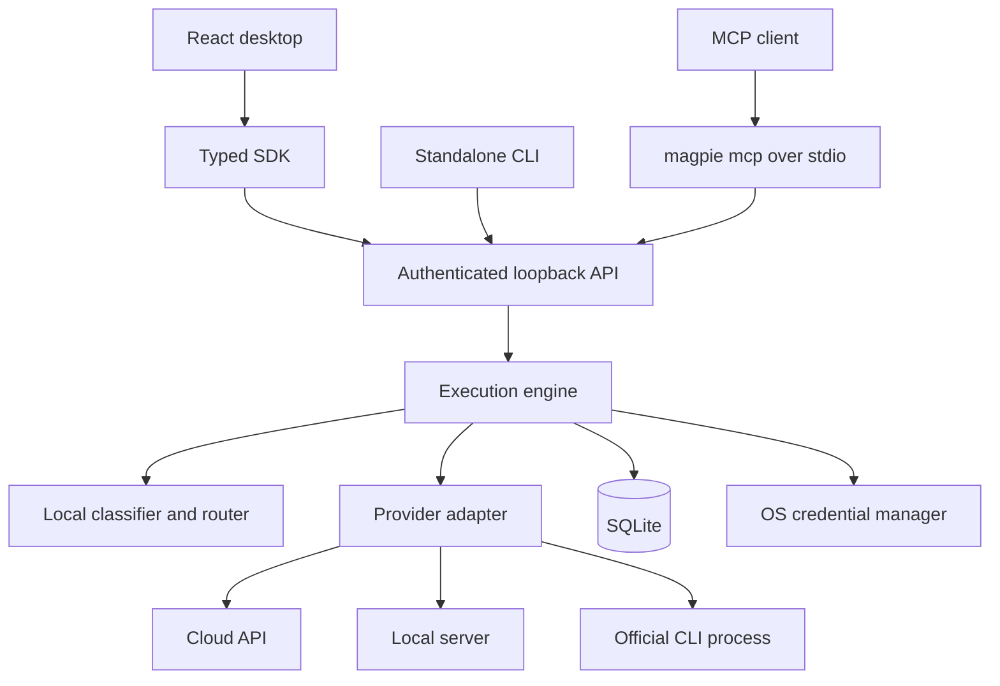

# How Magpie works

Magpie separates the desktop window, long-running local service, provider adapters, and integration clients. This keeps routing and execution available without depending on a webview being open.

## Process and trust boundaries

The Tauri executable has a window mode and a `--harness` mode. Daemon mode starts Rust/Tokio before any webview/tray/display initialisation. `magpie serve` runs the same runtime from the separate CLI. The desktop discovers a healthy authenticated service or launches one detached.

The owner's bootstrap token stays in a private data directory. The desktop holds its connection in memory. External clients receive scoped, revocable tokens rather than upstream provider credentials. Loopback binding, Host checks, and restricted browser origins protect this local boundary; they do not isolate one OS user from malicious software already running as that user.

## Startup and shutdown

1. Resolve `MAGPIE_HOME` or the platform data location.
2. Acquire the process-lifetime filesystem lock for that directory.
3. Open SQLite, apply migrations, load settings, and initialise adapters/monitoring.
4. Bind the configured local address and port.
5. Write `harness.json` with PID, URL, application/API version, and start time.
6. Serve requests and publish live events.

Discovery validates the service rather than trusting the runtime JSON alone. A leftover lock file is not itself proof of a live process; the OS-held lock matters. Do not delete locks while another process is using the database.

On shutdown the engine cancels active executions and drains the HTTP service. The runtime file is removed only if it still describes that process. On a later start, incomplete stored executions are recovered as interrupted rather than treated as continuing work.

The default desktop close behaviour stops the service. Tray hiding, continued background execution, and startup at login are separate opt-ins. See [Settings and storage](Settings-and-storage.md).

## One request from start to finish

| Stage          | Responsibility                                                              | Evidence to inspect                          |
| -------------- | --------------------------------------------------------------------------- | -------------------------------------------- |
| Admission      | Host validation, bearer authentication, required scopes, body parsing       | HTTP status and error type                   |
| Normalisation  | Convert native/Chat Completions messages into the common execution contract | API converter and validation errors          |
| Classification | Use explicit task hints or inexpensive local heuristics                     | Classification signals and estimated context |
| Eligibility    | Remove unusable accounts/models and unmet requirements                      | Rejected candidates/reasons                  |
| Ranking        | Apply preset, rules, preferences, cost/allowance information, history       | Candidate scores/components                  |
| Execution      | Select adapter, acquire concurrency permit, forward events                  | Started event, model/account, attempt        |
| Recovery       | Decide whether retry/fallback is safe and permitted                         | Routing changes and attempt errors           |
| Completion     | Store supported telemetry and emit terminal event                           | Completed/failed event and Activity record   |

Routing previews stop before execution. They can validate request shape and explain selection without issuing inference. Context size and catalogue-derived quality/speed/price values may be estimates; classification itself is not a paid model call.

## Adapters and capability negotiation

Adapters implement verification, discovery, execution, and optional limit/account-report methods. API adapters translate the unified request into their provider protocol. CLI adapters delegate to installed official executables using provider-owned authentication and policies.

The router checks tools, vision, structured output, reasoning, and agent requirements against reported/catalogued model capabilities. Unknown or estimated metadata must remain distinguishable from provider-reported facts. A custom endpoint that resembles one protocol may still reject individual options.

Function tools and CLI agents are different execution models. In the function-tool case, Magpie returns calls for the requesting application to execute and include as tool-result messages. In agent mode, the official CLI owns its tool loop and can access local context. Codex/Gemini require explicit `agent.working_dir`; filesystem access is not silently inferred from an ordinary prompt.

## Retry, fallback, and cancellation

The engine limits attempts and only retries/falls back under its safety and routing policy. Meaningful output, tool events, or write-capable agent requests prevent blind replay. A stream can therefore end in failure even when another account exists. Retrying an operation externally can duplicate side effects that occurred before the failure.

Subscription-to-API switching has a separate billing opt-in. Explicit model pinning needs `allow_fallback: false` if the model must remain fixed. Since 0.1.3, saved-account failures also trigger eligibility rechecks; see [Saved sign-ins](Saved-sign-ins.md).

Closing an execution stream signals cancellation; an administrative endpoint can cancel by execution ID. Cancellation is best effort at the provider/process boundary and is not an undo mechanism. The live event stream has no durable replay cursor. Use retained execution records after reconnecting.

## Persistence and privacy

SQLite uses migrations, WAL mode, foreign keys, and indexed execution/model/account fields. It stores connection metadata, models, preferences, executions, known limits, configuration, hashed integration keys, and notifications. Production provider secrets live in Keychain, Windows Credential Manager, or Secret Service.

Request/response content is omitted by default. Execution metadata can still identify a provider, account label, model, task class, error, and token/cost totals. CLI tools may retain their own history independently. Read access spans retained telemetry across clients; content inspection is administrative.

The account-usage monitor and local execution history serve different purposes. Provider account snapshots can include external work and must not be added to the local total. The UI uses events to invalidate queries and polling to refresh supported views; neither manufactures missing data. [Usage and limits](Usage-and-limits.md) explains provenance.

## Code map

| Layer                                   | Source directory          |
| --------------------------------------- | ------------------------- |
| Shared contracts                        | `crates/magpie-core`      |
| Credential/token/redaction boundary     | `crates/magpie-security`  |
| Storage and migrations                  | `crates/magpie-store`     |
| Provider protocols and CLI processes    | `crates/magpie-providers` |
| Classification and model selection      | `crates/magpie-router`    |
| Accounts, execution, events, monitoring | `crates/magpie-engine`    |
| HTTP routes, scopes, conversions        | `crates/magpie-api`       |
| Process discovery and lifecycle         | `crates/magpie-runtime`   |
| CLI/MCP                                 | `apps/cli`                |
| Native shell                            | `apps/desktop/src-tauri`  |
| React presentation                      | `apps/desktop/src`        |
| TypeScript client/contracts             | `packages/sdk`            |

For implementation changes, use [Fixing issues](Fixing-issues.md) and [Development and testing](Development-and-testing.md). The concise [architecture note](https://github.com/ChristianRelf/Magpie/blob/main/docs/ARCHITECTURE.md) provides additional repository context.
